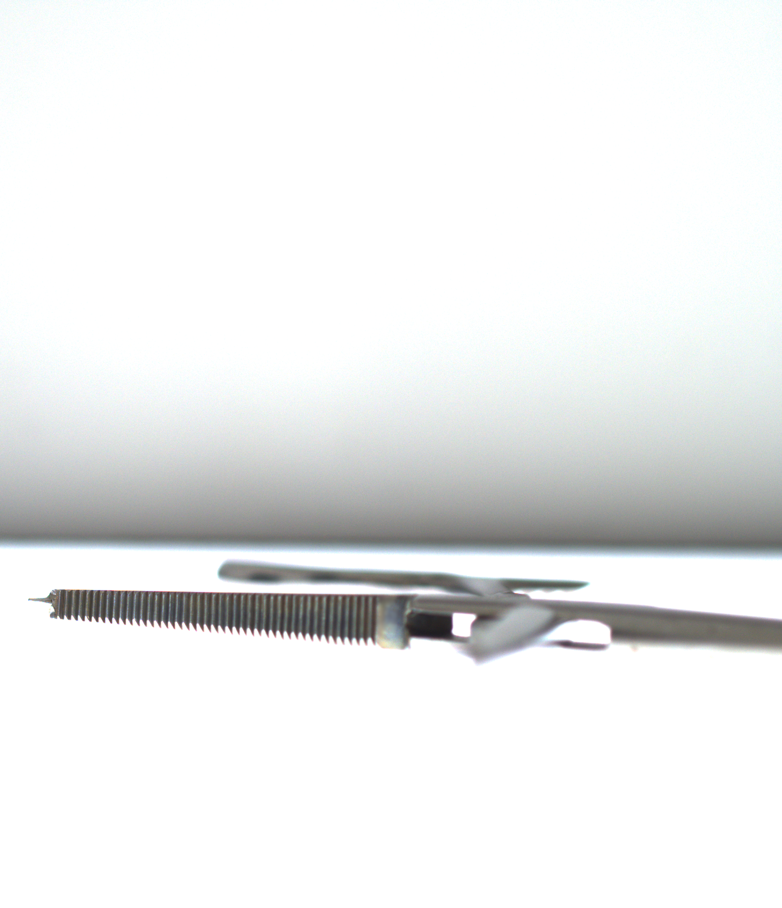
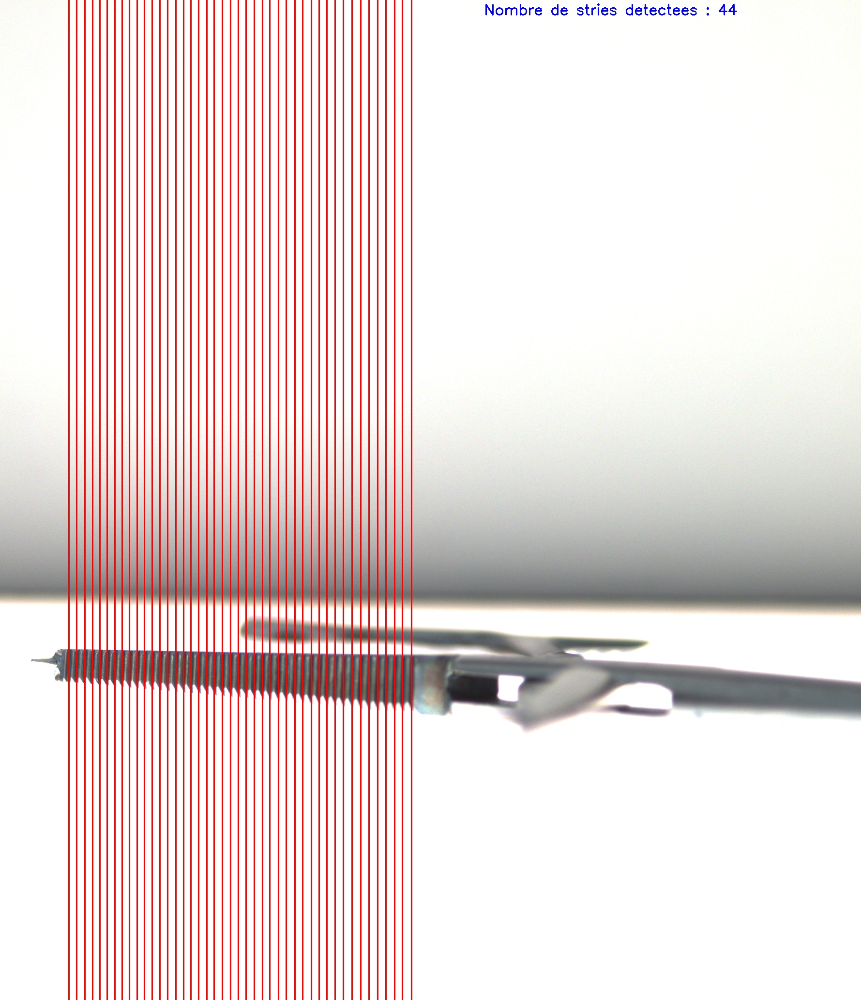
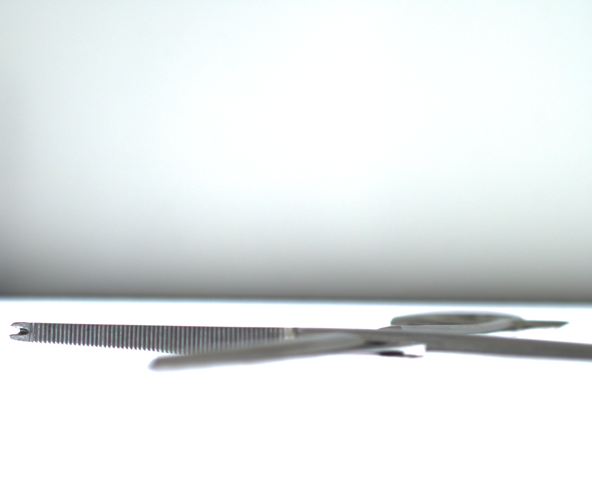
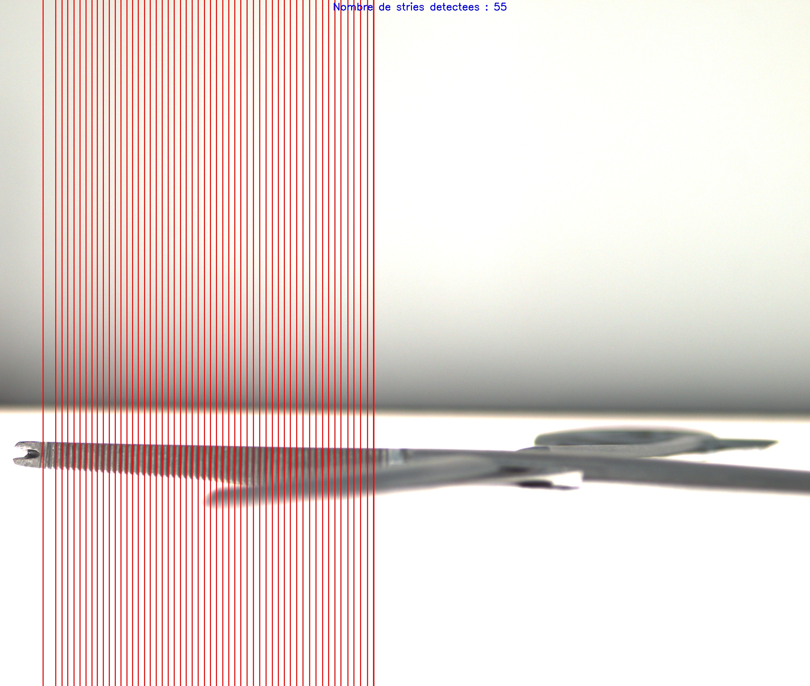
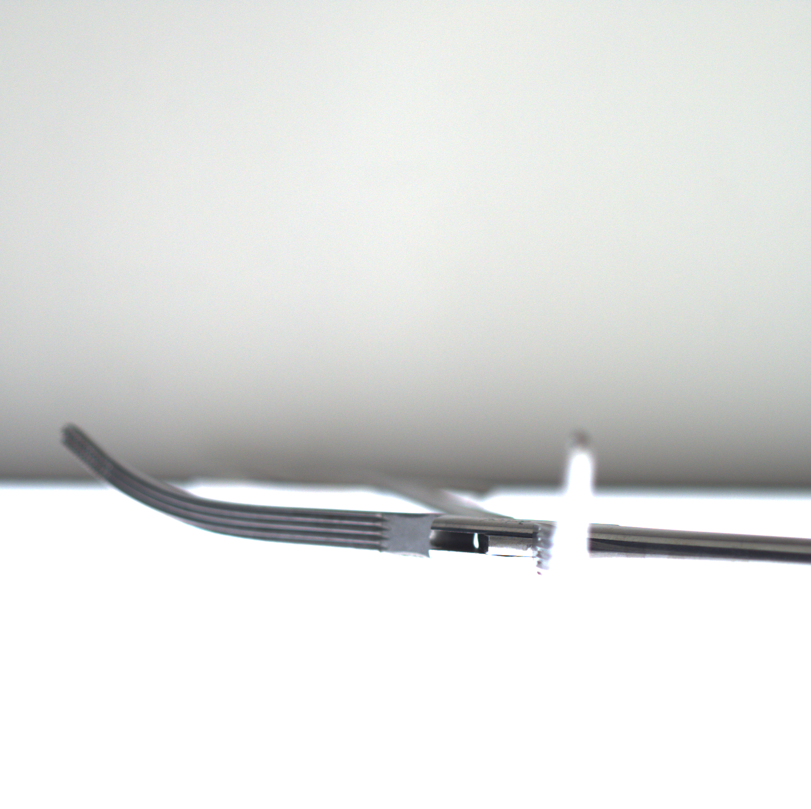
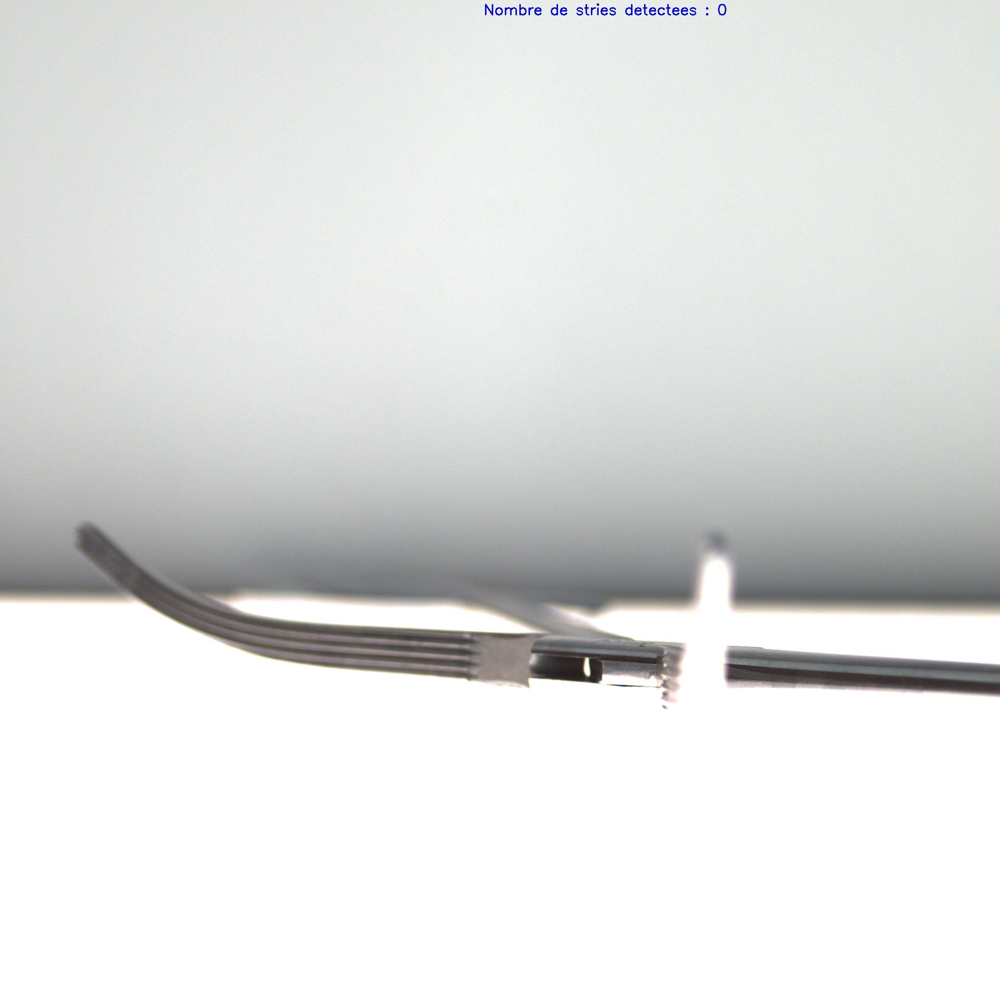

# Streak Detection

## Description
This project involves detecting vertical streaks in images of open clamps. You have three different images, each depicting the interior of a clamp. Two of these images contain vertical streaks, while the third does not.

### Requirements

- **Python:** The script has been developed and tested with Python 3.8.2.
- **Libraries:** The following libraries are required:
  - numpy 1.24.4
  - opencv 4.9.0
  - os 
  - json
  - matplotlib

### Articles with Vertical Streaks Inside:
- Article 1
- Article 2

### Article without Vertical Streak Inside:
- Article 3

The objective is to develop a program that automatically detects and counts the vertical streaks in each image. The program will generate new RGB images for each article where the detected streaks are highlighted.

## Details
- All images were captured using the same camera, from the same position, and under identical lighting conditions.
- To assist in segmenting each clamp in its respective image, you can use `empty_room.png`, which was captured under similar conditions but without any article in front of the camera.
- Each article image has been cropped on the left. To determine the number of pixels cropped for each article, refer to the following JSON files:
  - `crop_article1.json`
  - `crop_article2.json`
  - `crop_article3.json`

## Process
1. The program will sequentially process the 3 images located in the directory `<Dataset>`.
2. For each image, it will generate a new image in JPG format that highlights the detected vertical streaks.

## Output
- After running the program, you will obtain three new images:
  - `article1_streaks_detected.jpg`
  - `article2_streaks_detected.jpg`
  - `article3_streaks_detected.jpg`
  
  These images will show the original clamp images with highlighted vertical streaks and annotations indicating the number of streaks detected.

## Note
- Adjust parameters such as threshold values for streak detection in the code (`process_image` function) if necessary.
- Ensure file paths are correctly specified in the code before running.

---

## Program Results

In this section, you can view the program results. The original image is displayed on the left, while the program's result is displayed on the right.

<table><tr>
<td> 
  <h3 align="center">Image</h3>
  

    
  
 
</td>
<td> 
  <h3 align="center">Streak Detection</h3>
  

    
  
 
</td>
</tr></table>

<table><tr>
<td> 
  <h3 align="center">Original Image</h3>
  

    
  
 
</td>
<td> 
  <h3 align="center">Streak Detection</h3>
  

    
  
 
</td>
</tr></table>

<table><tr>
<td> 
  <h3 align="center">Original Image</h3>
  

    
  
 
</td>
<td> 
  <h3 align="center">Streak Detection </h3>
  

    
  
 
</td>
</tr></table>

## Contributing

Feel free to fork this project, submit issues and pull requests. Contributions are welcome!
